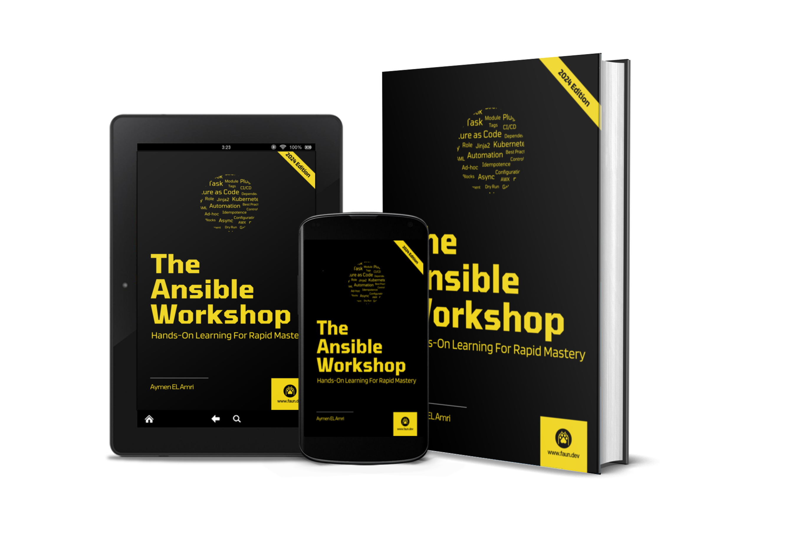

# The Ansible Workshop: Hands-On Learning For Rapid Mastery

This repository contains the code snippets used in [The Ansible Workshop](https://amzn.to/4aNym1n) book.

## About the Book

In "The Ansible Workshop," you will deep dive into the world of Ansible, the amazing automation tool that converts complex IT tasks into a set of easy, simple-to-repeat steps. This guide is your roadmap to mastering Ansible, whether you are a novice just starting to use Ansible or an intermediate user who has already used Ansible and is looking for additional information and tricks to enhance your skills.

To start with, we will unwrap the essence of Ansible. You will explore what Ansible is, its declarative vs imperative automation approach, and dive into its architecture that exposes Ansible's inner workings. This is basically building the foundation for everything shown henceforth.

At its core, Ansible is configuration management and application deployment. You will learn how to use ad-hoc commands and playbooks to automate server configurations and application deployment. We will cover creating simple playbooks and developing advanced ones, giving you the tools required to manage multiple scenarios and orchestrate complex tasks.

In today's dynamic containerized environment, the integration of Ansible with Docker and Kubernetes is crucial. You will learn how to build, tag, and push Docker images, as well as manage Docker containers, networks, and volumes, and even orchestrate Docker using Ansible. For the fans of Kubernetes out there, we dive into deploying and managing Kubernetes clusters using Ansible and Kubespray, then we explore how to deploy your workloads to Kubernetes using Ansible.

This guide provides comprehensive coverage of each and every minute part of Ansible:

- **Inventory**: know and make use of advanced inventories.
- **Facts**: How to locate and utilize Ansible facts.
- **Vaults**: The art of managing sensitive data in a better way.
- **Blocks**: Managing errors gracefully, using Ansible blocks.
- **Modules and plugins**: Expanding the horizon of Ansible.
- **Filters**: Using Ansible filters for data transformation.
- **Roles**: Running many playbooks through Ansible roles.
- **Collections**: Discovering and using collections of Ansible.
- **Ansible Galaxy**: Everything about Ansible Galaxy and how it can be used, explained.
- **Developing your modules**: Briefing on how one can develop their Ansible module.
- **Developping custom filters**: Learn how to develop your own Ansible filters.
- **Integrating other tools with Ansible** (e.g. Kubernetes, Docker, ChatGPT, or whatever).
- **And much more!**

Every concept is supported by examples from real-world use and best practices. You will find out how to use IDEs for better writing playbooks, debugging, and optimizing Ansible performance. We also cover how to create custom modules and filters – including a special module leveraging generative AI (ChatGPT).
